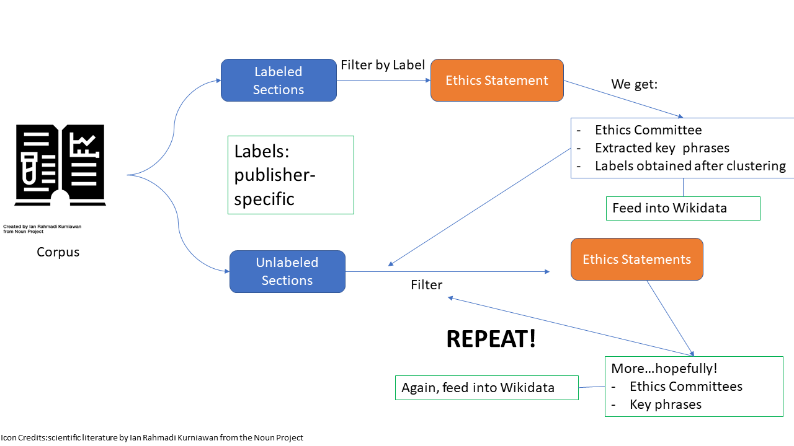

**Table of Contents**
- [1. Project Workflow](#1-project-workflow)
- [2. Flowchart](#2-flowchart)
- [3. Brief Description](#3-brief-description)
# 1. Project Workflow
The project has gradually grown, with multiple iterations and discussions driving it. Our main goal with Ethics Statement is to build a workflow that snowballs. With the help of Peter, Daniel, and Ayush, we have come up with a workflow. 

# 2. Flowchart

# 3. Brief Description
Our main goal is to extract structured information from unstructured Ethics Statements in papers. The information can key phrases in these statements, the ethics committees, approval numbers and so on. 

From our exploratory analysis of `XML` sections of papers retrieved from `pygetpapers`and sectioned by `ami`, we have discovered that the file labellings for Ethics Statements (or any sections, as a matter of fact) are publisher-specific. And, some publishers do not explicitly label the `.xml` files at all. To summarize, we are working with two types of sections - labelled and unlabelled. 

When working with labelled sections, we can easily filter ethics statements from the rest of the sections - using glob. We, then, employ [spaCy](https://spacy.io/) to extract named entities (i.e., the ethics committees) and [`pke`](https://github.com/boudinfl/pke) for extracting key phrases. At this point, we can feed the data to Wikidata. 

By feeding the information to Wikidata, we can use SPARQLWrapper to get all the ethics committees and key phrases into `ami` dictionaries (XML). The dictionaries can help us retrieve ethics statements from unlabelled sections. Like before, we can use spaCy and `pke` to extract, potentially, new ethics committees and more key phrases. 

Retrieve information -> extract information -> use extracted information to retrive information -> extract more information 

The prototype code can be found, [here](https://github.com/petermr/dictionary/blob/main/ethics_statement_project/ethics_statement_generic.py). 

